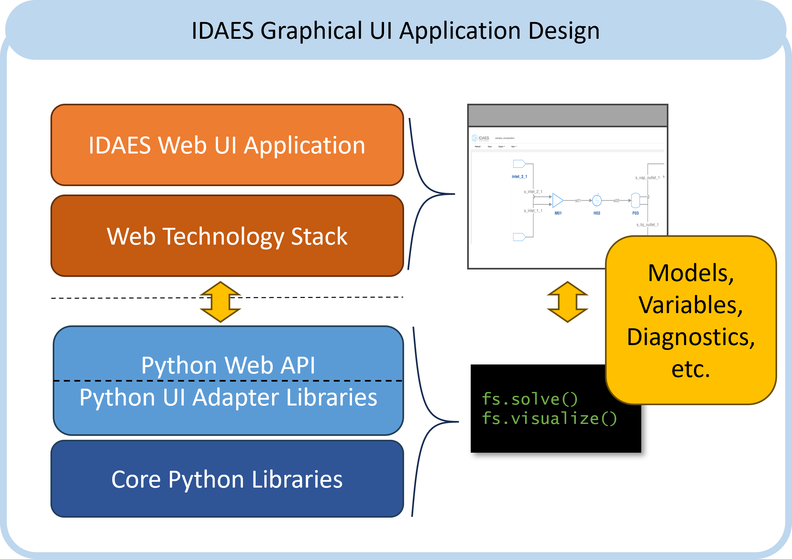

# Design

Currently there is one IDAES UI, the Flowsheet Visualizer (FV).
The architecture and design of the FV uses a pattern that is shared
across other UIs in other Advanced Process Systems Engineering applications
based on the IDAES Integrated Platform (IDAES-IP), e.g. WaterTAP and PARETO.
The basics of this design are illustrated below.
The main goal of a common design is to enable web applications that can be
run on the desktop by an individual user or as a service across users.
A secondary goal is to build a common set of front-end and 
back-end UI support libraries that can unify and accelerate application
development across the IDAES-IP.

