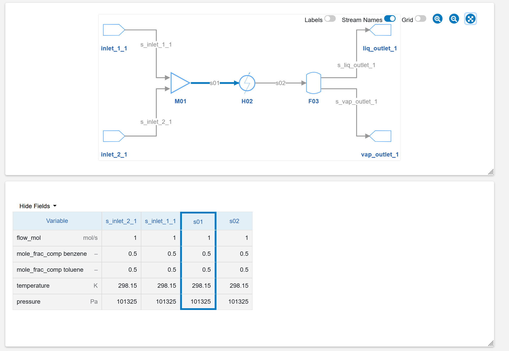
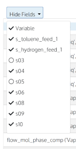

# Flowsheet Visualizer
The main UI for IDAES is the Flowsheet Visualizer (FV).

## Overview

The FV displays IDAES *flowsheets* (connected components representing a system or 
sub-system to be optimized). 
The FV uses web technologies (HTML, CSS, JavaScript).


## Usage

### See an example flowsheet
An example flowsheet is included and can be viewed with the following terminal command:

```shell
python -m idaes_ui.fv.example
```

### Visualize your flowsheet
To use the FV to visualize your own flowsheet:
* From within a **Jupyter Notebook**:
```python
# create the flowsheet and put in variable 'flowsheet'
flowsheet.visualize("Flowsheet Name")
```
* From within a **Python script**, add a keyword argument if you want the visualizer to keep running: 
```python
# create the flowsheet and put in variable 'flowsheet'
flowsheet.visualize("Flowsheet Name", loop_forever=True)
```

## Features
Below is a walk-through of the features of the Flowsheet Visualizer tool.

### Main window
The main window has a diagram panel at the top and a "stream table" panel below it.


### Resize the main panels
You can change the size of each panel with the "resize" tool in the lower right corner.


### Zoom the diagram
At the top right are controls that allow zooming in and out for the diagram, as well as "fitting" the diagram in the window.


### Manipulate the diagram

#### Move components
You can move the components representing IDAES unit models by clicking and dragging them.


#### Rotate components
If you use the "right click" on a component, it will rotate 90 degrees clockwise.


#### Add elbows to connections
To add additional elbows in a connection between two components, click on the line that connects them.


#### Remove elbows from connections
To remove an elbow in a line, double-click on it.


### Group components
For large and complex diagrams, moving components one at a time can become tedious.
To help, the Flowsheet Visualizer allows you to group elements by dragging a rectangle
around them. Then the selected components can be moved as a group.


### Stream table

The stream table shows values of variables for the "streams" connecting components.
A small colored dot indicates fixed (vs. free) variables.

Streams can be rearranged by dragging their header left or right.


#### Stream/diagram "brushing"

To help see where the streams are in the diagram, the Flowsheet Visualizer
uses a technique called, in statistics, "brushing" to visually link the two elements.

Selecting a stream in the table, by hovering over its column with a mouse, will 
highlight the corresponding line in the diagram.
Similarly, selecting a line in the diagram will highlight the corresponding 
stream in the stream table.

* 

#### Hide/show streams
You can select fields to hide/show in the stream table -- particularly useful when you have many streams.


