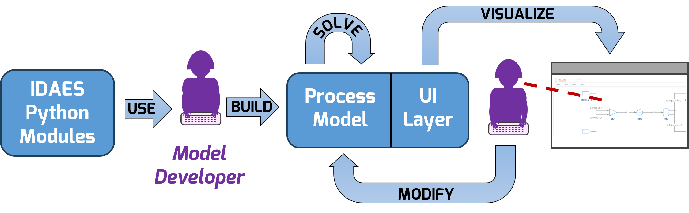

# IDAES User Interface Documentation

This documentation describes user interfaces (UIs) for the
<a href="https://idaes.org" target="_blank">Institute for Design of Advanced Energy Systems (IDAES)</a>
Integrated Platform, which are distributed through the [idaes-pse](https://pypi.org/project/idaes-pse/)
package on PyPI.

```{toctree}
---
maxdepth: 1
---
install.md
fv.md
design.md
```

</img>

*Diagram showing the basic workflow for model developers using the IDAES visualization tools*

