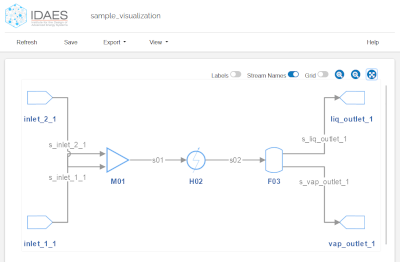
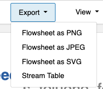

<span id="top" />

# IDAES UI

The Institute for the Design of Advanced Energy Systems Integrated Platform (IDAES-IP) consists of high-level capabilities that solve complex design and optimization problems with the core IDAES software framework, which makes use of state of the art equation-oriented optimization  solvers. For more details on these components, see the [IDAES documentation](https://idaes-pse.readthedocs.io/en/stable/). 

This documentation is for *user interface* components that build on top of the IDAES core Python library and applications. This documentation is for all users; additional information relevant for software developers of the IDAES platform will be prefixed with "💻Developers".

Sections:

* [Getting started](#getting-started) - Install the software
* [Flowsheet Visualizer](#fv) - Visualize flowsheet layout and properties.

<span id="getting-started" />

## Getting Started

The IDAES UI components are distributed as a Python package using the Conda package management system from [Anaconda](https://docs.anaconda.com). They are normally installed with the IDAES software. For details, see the [IDAES installation instructions](https://idaes-pse.readthedocs.io/en/latest/tutorials/getting_started/index.html).

<br>

**Install IDAES-UI:**
<br>
*This is on the [PyPI test rpository](https://test.pypi.org/project/idaes-ui-test/), Please check back for updates to the documentation in the future.*
```
pip install -i https://test.pypi.org/simple/ idaes-ui-test
```
**Run example:**
```sh
idaes-ui-example
```

----

<br>

## 💻Developers: 
<!-- To install the UI components from GitHub, follow the procedures outlined in the IDAES-IP [Advanced User Installation](https://idaes-pse.readthedocs.io/en/latest/tutorials/advanced_install/index.html) section to set up your environment. Then you should fork and clone the [idaes/idaes-ui](https://github.com/IDAES/idaes-ui.git) repository and install it with:  -->

Install IDAES-UI from Github:
1. Fork and clone the [idaes/idaes-ui](https://github.com/IDAES/idaes-ui.git) repository.
2. Create conda environment:
```sh
conda create -n idaes-ui python=3.10
```
```sh
conda activate idaes-ui
```
3. Go to the IDAES-UI folder you just cloned.
4. Run the pip command for local installation.
```sh
pip install -e .
```
5. **Run example:**
```sh
idaes-ui-example
```

----

<span id="fv" />

## Flowsheet Visualizer

Screenshot of the Flowsheet Visualizer:



The IDAES-IP [Flowsheet Visualizer](#flowsheet-visualizer) (FV) is a graphical user interface that displays complex *flowsheets* (connected components representing a system or sub-system to be optimized) created with the IDAES-IP Python core software. The FV uses web technologies (HTML, CSS, JavaScript) so is cross-platform and has identical functionality on computers running Windows, Mac, and UNIX.

---

**FV Sections:** [Tutorials](#fv-tutorials) | [How-to](#fv-howto) | [Reference](#fv-reference)

---

<span id="fv-tutorials" />

### **Tutorials:**

#### **Example flowsheet:**

A simple example flowsheet is included and can be viewed with:

```sh
idaes-ui-example
```

<span id="fv-howto" />

### **How-to:**

**Visualize your flowsheet**

*Once you have installed this package, within the same conda environment, you can create your model in a Python script and view it by calling the `visualize()` function, which will display your flowsheet model in a browser window.*

**Steps:**

  1. Import dependencies
  2. Import the visualiz function
  3. Generate your flowsheet
  4. Call the visualize function

  ```python
  # 1. Import dependencies
  from pyomo.environ import (
    Constraint,
    Var,
    ConcreteModel,
    Expression,
    Objective,
    SolverFactory,
    TransformationFactory,
    value,
  )
  from pyomo.network import Arc, SequentialDecomposition
  from idaes.core import FlowsheetBlock
  from idaes.models.unit_models import (
      PressureChanger,
      Mixer,
      Separator as Splitter,
      Heater,
      StoichiometricReactor,
  )
  from idaes.models.unit_models import Flash
  from idaes.models.unit_models.pressure_changer import ThermodynamicAssumption
  from idaes.core.util.model_statistics import degrees_of_freedom
  import idaes.logger as idaeslog

  # 2. Import the visualiz function
  from idaes_ui.fv import visualize

  # 3. Generate your flowsheet here

  # 4. Call the visualize function
  # It will open a browser window and run on an available port.
  visualize(YourFlowsheet, "YourFlowSheetName", loop_forever=True)
  ```

---

**Save the visualization:**
* Export &rarr; Flowsheet to save the flowsheet as an image
* Export &rarr; Stream table to save the stream table as comma-separated values
  
  

---

**Basic controls in the diagram:**

Unit models (shapes)
* Click and drag unit models to move them 
  * Right-click on a unit model to rotate it 90 degrees
  * Drag in an open area to create a rectangle that selects multiple unit models at once

Streams (lines)
* Drag streams to change their routing 
  * Click on the line to create a new segment for routing, and eliminate that segment by clicking the dot that appears on mouseover


<span id="fv-reference" />

---

**Reference:**

See the [visualize()](https://github.com/IDAES/idaes-ui/blob/main/idaes_ui/fsvis/fsvis.py) function code for documentation on its options and behavior. 


